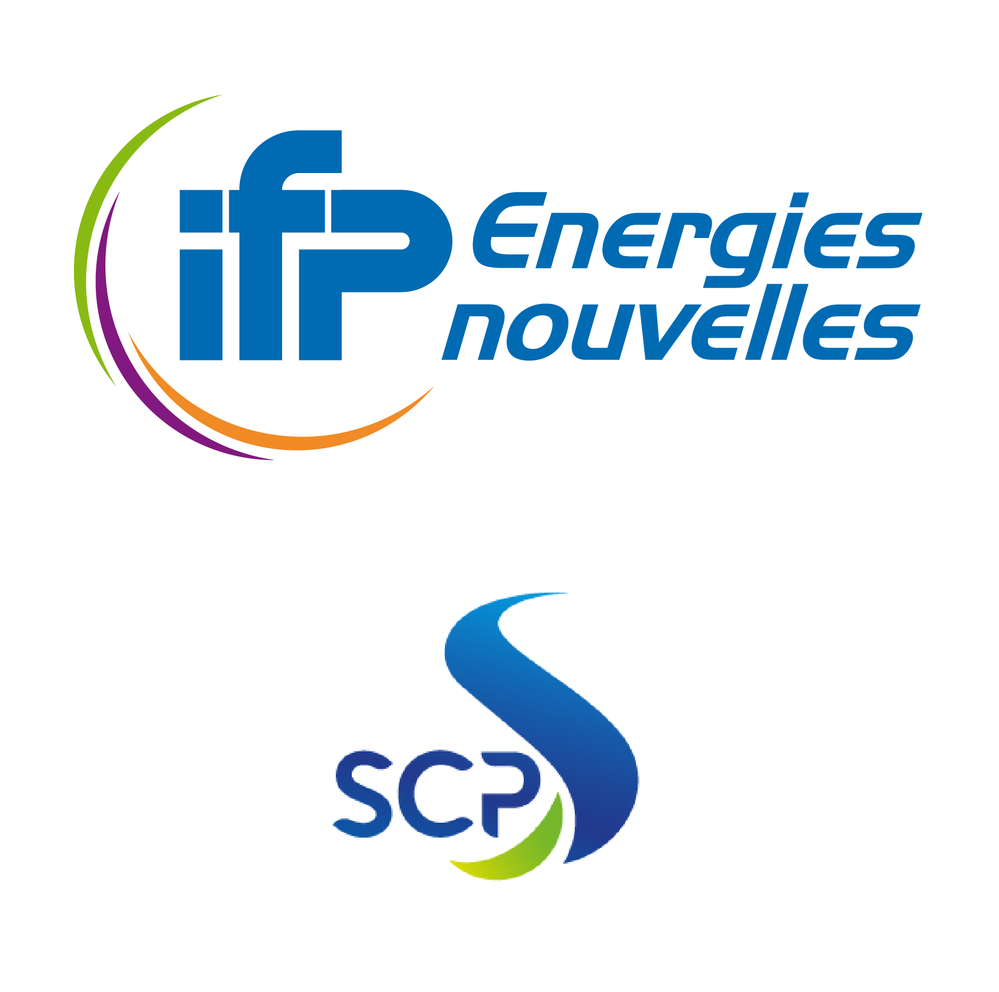

## Hi there, Welcome on my Github Page ! 

I'm passionate about coding and committed to turning my GitHub into a well-structured, valuable documentation hub.  
I focus on creating clear, reusable, and insightful resources to help others learn and build effectively.

___

### About Me 🚀
👨‍💻 Passionate about Data Science & AI  
🧑‍🎓 Lifelong learner, always curious  
✍️ Obsessed with clean, well-structured documentation  

___

### My professional expéricence as datascientist 🙌
- [IFPEN (Institut Français du Pétrole Energies Nouvelles)](https://www.ifpenergiesnouvelles.fr/)
- [SCP (Société du Canal de Provence)](https://canaldeprovence.com/)

  

### Competitions & Organizations I Participated With :
- [CSIRO (Commonwealth Scientific and Industrial Research Organisation)](https://www.csiro.au/) 
- [Physionet (2,000+ open-source physiological datasets for medical research)](https://physionet.org/)
- Google
- [UC Davis (University of California, Davis)](https://www.ucdavis.edu/)

  

___

### Featured Projects 📌

- 🔍 [**SQL Learning**](https://github.com/Jean8900/sql_learning)
  A complete SQL course combining theory and hands-on practice in Jupyter Book.
  Covers core and advanced topics like SELECT, JOINs, GROUP BY, CTEs, window functions, CRUD operations, transactions, stored procedures, indexing, and data validation.
  Ideal for beginners, refreshers, and advanced learners aiming to strengthen their SQL skills for real-world data analysis.
___

### Current projects 🚧

- [AI Mathematical Olympiad](https://www.kaggle.com/competitions/ai-mathematical-olympiad-progress-prize-3) sponsored by [XTX Markets](https://www.xtxmarkets.com/) — Competition focused on pushing the frontier of AI mathematical reasoning, with a **$2.2M prize pool**. The goal is to close the gap between open-source and proprietary LLMs, which currently dominate the market (e.g., **GPT-5.2**, **ClaudeOpus 4.5**, **Gemini 3**). Currently, we rely on **GPT-120B OSS running on TPU v5e-8** for its speed and strong reasoning performance, as shown by the **[Artificial Intelligence Index](https://artificialanalysis.ai/)** (benchmarks across top open-source and proprietary models). The model weights are available here: **https://huggingface.co/openai/gpt-oss-120b**

- Preparing for [AWS Certified Machine Learning – Associate](https://aws.amazon.com/fr/certification/certified-machine-learning-engineer-associate/) —
Demonstrates ability to design, build, train, and deploy ML models on AWS using SageMaker, including data preparation, feature engineering, hyperparameter tuning, evaluation, and monitoring. Covers ML workflows, model optimization, and production-ready deployment.

___

## ⚙️ Languages & Tech Stack

**Languages :**  
<code></code>
<code></code>
<code></code>
<code></code>

| **Domain**              | **Technologies**                                                                                                                                                                                                                                        |
|-------------------------|----------------------------------------------------------------------------------------------------------------------------------------------------------------------------------------------------------------------------------------------------------|
| **Data Science & ML**   |         |
| **Web & UI**            |    |
| **AI & Automation**     |    |
| **Databases**           |    |
| **Environments**        |   |

___
### Connect with me 🌍 

